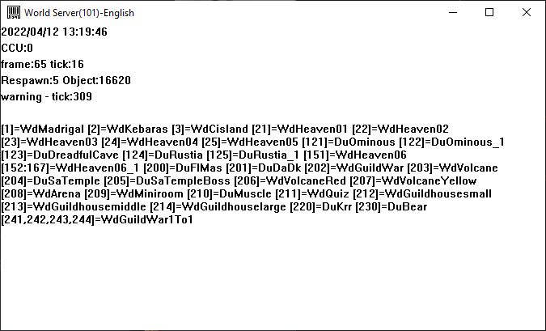

# New features

In general, useleSS does not aim to add new features, including V16+ official
features.

Howewer, some minor features may still be added. This document list them.

## WorldServer dialog display of worlds

- Text is now wrapped by the window
- The world ids are displayed and grouped by world name
- The list of sorted by world id.

## Party skills

- Link Attack is applied to ~~the party leader~~ everybody in the party
Possible bug: it may be applied to everybody even without a parskill (TODO: check)

## Exp reward

- Exp reward is computed over the total hp of a monster, not a mix of the total hp
and the damage dealt by all the connected players

