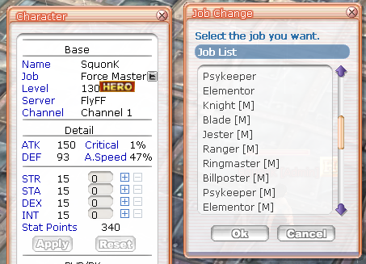
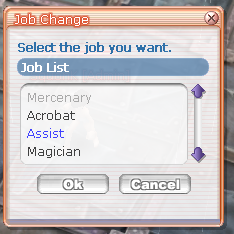

# New features

In general, useleSS does not aim to add new features, including V16+ official
features.

Howewer, some minor features may still be added. This document list them.

## WorldServer dialog display of worlds

- Text is now wrapped by the window
- The world ids are displayed and grouped by world name
- The list of sorted by world id.

## Party skills

- Link Attack is applied to ~~the party leader~~ everybody in the party
Possible bug: it may be applied to everybody even without a parskill (TODO: check)

- Users may move party skills from the window to shortcuts even if they are not
the leader / if the party has not reache the required level.

## Exp reward

- Exp reward is computed over the total hp of a monster, not a mix of the total hp
and the damage dealt by all the connected players

## Guild war

Guild Combats / Eve school / Guild Sieges do not require the guild to have
the guildmaster or a kingpin. The defender can also be the current guildmaster.

## Change Job window

- The `CDPSrvr::OnChangeJob` has been fixed and features related to it work.

- The change job button in the character info (H) and *Scroll of Class Change*
uses the same window.

 

- Game masters can change to any job

- Using the scroll will only give access to job of the same type: for example
if you are master, you can only access master jobs.

## Guild logo

The guild master can change their guild logo or even remove it.
This feature can be disabled in *CommonHeader.h*.
